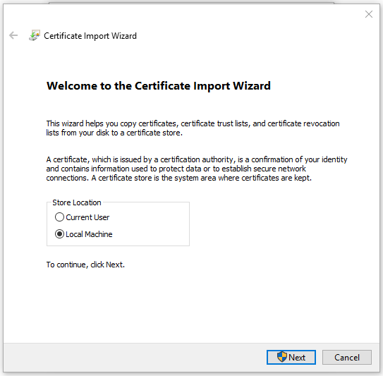

# How to Create Valid SSL in localhost for XAMPP


To create a valid SSL certificate for your localhost in XAMPP, you generate a self-signed certificate and configure XAMPP’s Apache server to use it. This enables HTTPS for your local projects, simulating a secure production environment and preventing browser security warnings during development.

**In this step we are going to crate SSL and setup “site.test” website.**
## Step 1: Create a folder in that page
In regular install it’s in C:\xampp\apache

**This is where we will store our cert. In this example I will create “crt” folder. So we will have C:\xampp\apache\crt**


## Step 2: Add this files
1. [cert.conf](./cert.conf)
2. [make-cert.bat](./make-cert.bat)

## Step 2: Edit the cert.conf
Edit the **cert.conf** file to add your own domain. For example: I'm using the domain **site.test**.


## Step 3: Run the make-cert.bat

Double click the **make-cert.bat** and input the domain **site.test** when prompted. And just do enter in other question since we already set the default from **cert.conf**.


## Step 4: Install the certificate in windows
After that, you will see site.test folder created. In that folder we will have server.crt and server.key. This is our SSL certificate.
Double click on the server.crt to install it on Windows so Windows can trust it.


And then select **Local Machine** as Store Location.



And then Select “**Place all certificate in the following store**” and click **browse** and select Trusted Root Certification Authorities.


Click **Next** and **Finish**.
And now this cert is installed and trusted in Windows. Next is how how to use this cert in XAMPP.

## Step 5: Add the domain in Windows hosts
1. Open notepad as administrator.
2. Edit C:\Windows\System32\drivers\etc\hosts (the file have no ext)
3. Add this in a new line:
```bash
127.0.0.1 site.test
```
This will tell windows to load XAMPP when we visit http://site.test You can try and it will show XAMPP dashboard page.

## Step 6: Edit the httpd-vhosts.conf file
We need to enable SSL for this domain and let XAMPP know where we store the SSL Cert. So we need to edit C:\xampp\apache\conf\extra\httpd-vhosts.conf
And add this code at the bottom:
```bash
## site.test
 <VirtualHost *:80>
     DocumentRoot "C:/xampp/htdocs"
     ServerName site.test
     ServerAlias *.site.test
 </VirtualHost>
 
 
 <VirtualHost *:443>
     DocumentRoot "C:/xampp/htdocs"
     ServerName site.test
     ServerAlias *.site.test
     SSLEngine on
     SSLCertificateFile "crt/site.test/server.crt"
     SSLCertificateKeyFile "crt/site.test/server.key"
	 
	 <Directory "C:/xampp/htdocs">
	  Options Indexes FollowSymLinks
        AllowOverride All
        Require all granted
        <IfModule mod_php5.c>
            php_admin_flag engine on
            php_admin_flag safe_mode off
            php_admin_value open_basedir none
        </ifModule>
	</Directory>
	
 </VirtualHost>
```
After that, you will need to **restart** Apache in XAMPP.  It’s very simple, simply open XAMPP Control Panel and **Stop** and **re-Start** Apache Module.

## Restart your browser and Done!
This is required to load the certificate. And visit the domain on your browser, and you will see green lock!


I hope this tutorial is useful!
If you already use other method, let me know in the comment 🙂
